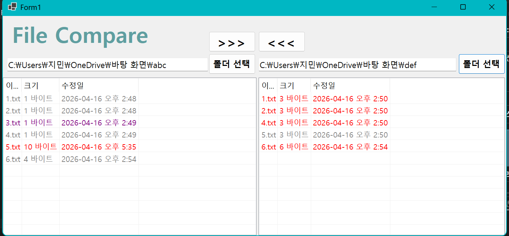
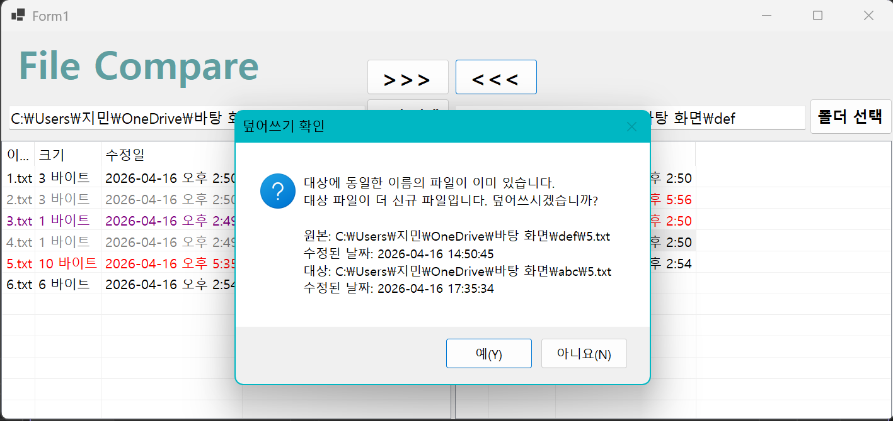

# (C# 코딩) 파일 비교 툴

## 개요
- C# 프로그래밍 학습
- 1줄소개: 
- 사용한 플랫폼 : 
	- C#, .NET Windows Forms, Visual Studio, GitHub
- 사용한 컨트롤 :
	- Label, Button, TextBox, ListView, SplitContainer, Panel
- 사용한 기술과 구현한 기능 :
	- Visual Studio를 이용하여 UI 디자인
	- 각 파일의 존재를 비교하고 원하는 파일을 복사하는 기능 구현

## 실행화면 (과제1)
- 코드의 실행 스크린 샷과 구현 내용 설명

- 구현한내용 (위 그림 참조)
  - UI 구성: Label(앱 이름 표시), TextBox(파일 위치 표시), Button(파일 선택), ListView(경로에 있는 파일의 종류 및 존재 여부 표시)
  - 파일 탐색기를 여는 버튼 구현
  - 경로 선택시 TextBox에 선택한 경로 표시

## 실행화면 (과제2)
- 코드의 실행 스크린 샷과 구현 내용 설명

- 구현한내용 (위 그림 참조)
  - 폴더 안 파일 표시: ListView에 TextBox에 기록된 경로에 있는 파일의 이름, 크기, 수정한 날짜 표시
  - 양쪽 폴더의 파일 비교: 한쪽에만 존재하면 보라색, 이름과 수정한 날짜가 같으면 검정색, 이름은 같지만 수정한 날짜가 오래된 건 회색, 최신이면 빨간색으로 표시

## 실행화면 (과제3)
- 코드의 실행 스크린 샷과 구현 내용 설명

- 구현한내용 (위 그림 참조)
  - 파일 복사 기능 구현 : 복사시 한쪽에 있는 파일을 다른쪽에 있는 경로에 복사시킴.
  - 만약 수정된 시각이 더 오래된 파일(회색)을 복사할 경우, 복사하겠냐는 경고 메시지 전달

