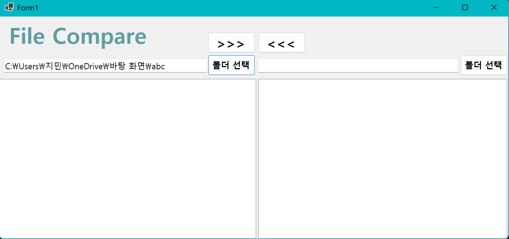

# (C# 코딩) 파일 비교 툴

## 개요
- C# 프로그래밍 학습
- 1줄소개: 
- 사용한 플랫폼 : 
	- C#, .NET Windows Forms, Visual Studio, GitHub
- 사용한 컨트롤 :
	- Label, Button, TextBox, ListView, SplitContainer, Panel
- 사용한 기술과 구현한 기능 :
	- Visual Studio를 이용하여 UI 디자인
	- 

- 수업중에배우고사용했던클래스들관련된설명
	- 
	- 
- 실습중에구현한기능들설명
	- 
	- 

## 실행화면 (과제1)
- 코드의 실행 스크린 샷과 구현 내용 설명

- 구현한내용 (위 그림 참조)
  - UI 구성: Label(앱 이름 표시), TextBox(파일 위치 표시), Button(파일 선택)
  - Placeholder 표시: 아이디와패스워드입력힌트를입력창안에회색으로표시
  - 로그인버튼: 아이디와패스워드가모두맞아야로그인허용

## 실행화면 (과제2)
- 코드의 실행 스크린 샷과 구현 내용 설명

- 구현한내용 (위 그림 참조)
  - UI 구성: Label(앱이름표시), TextBox2개(아이디, 패스워드)
  - Placeholder 표시: 아이디와패스워드입력힌트를입력창안에회색으로표시
  - 로그인버튼: 아이디와패스워드가모두맞아야로그인허용

## 실행화면 (과제3)
- 코드의 실행 스크린 샷과 구현 내용 설명

- 구현한내용 (위 그림 참조)
  - UI 구성: Label(앱이름표시), TextBox2개(아이디, 패스워드)
  - Placeholder 표시: 아이디와패스워드입력힌트를입력창안에회색으로표시
  - 로그인버튼: 아이디와패스워드가모두맞아야로그인허용

## 실행화면 (과제4)
- 코드의 실행 스크린 샷과 구현 내용 설명

- 구현한내용 (위 그림 참조)
  - UI 구성: Label(앱이름표시), TextBox2개(아이디, 패스워드)
  - Placeholder 표시: 아이디와패스워드입력힌트를입력창안에회색으로표시
  - 로그인버튼: 아이디와패스워드가모두맞아야로그인허용
